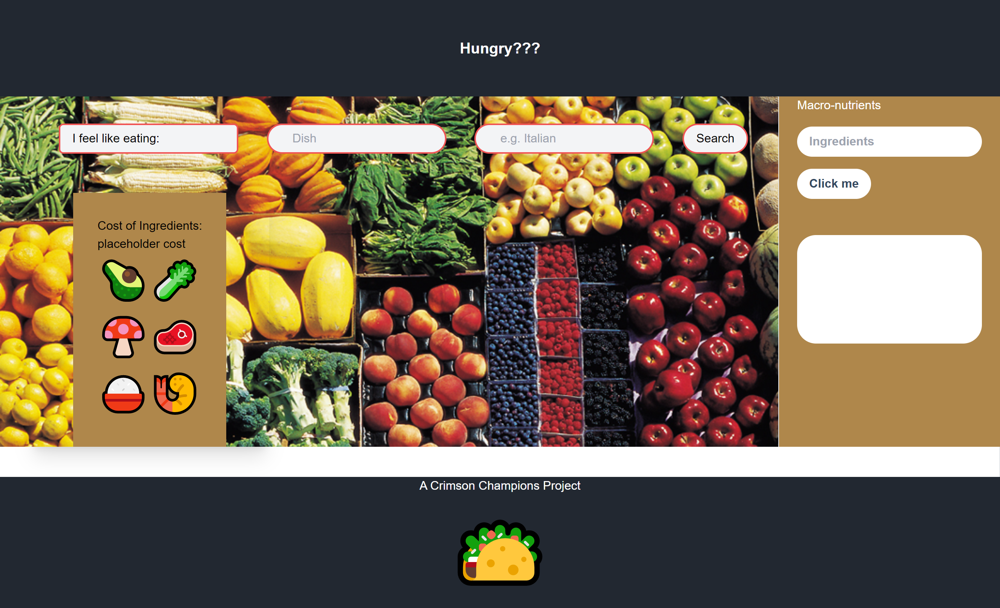

# Foodle

## Description

When we are hungry, there's so many choices that we often can't decide what to eat.
You can make something at home, order delivery, or even go to a restaurant.
Things can get more complicated when nutritional value or calories are considered.
Our website makes it simple to look up dishes, ingredients, nutrient information, and even their prices.
How about you click on the link and check it out?

## How does it work?

Just search for a dish and cuisine and pick from several options.
Once settled on a dish, you can click on it to see the ingredients and the price.
There is also a search bar for nutritional information like the amount of calories.

# Components of the JavaScript code

- Two API keys have have been generated, first one is the spoonacular API and the second is the Edamam API.

## Spoonacular API

- The Spoonacular API takes in the dish and cuisine input from the user and makes a fetch request which returns a list of dish names.
- Once the user clicks on a dish, a second fetch request is made using the dish id to get the ingredients for that particular dish.
- We then use the ID's of each ingredient to make a third fetch request that returns the prices for each ingredient.
- The `displaySum` function is used to calculate the total cost of the ingredients.

## Edamam API

- This API takes in the user's `ingredient` input and makes a fetch call to return the macro nutrients for that ingredient.
- The user can click on the `avoid this` button to avoid that ingredient from their recipe search.

## Local Storage

- The `saveIngredient` function saves the ingredients that the user chooses to avoid in an array in local storage.
- We then use `localstorage.getItem` in the `displayIngredient` function to change the color of the ingredients that user wants to avoid.

## Features and Validations

- The `I have this` button subtracts the amount of that ingredient from the total cost of ingredients and grays out that ingredient.
- The `Avoid this` button saves ingredients that user wishes to avoid in local storage.
- The avoided ingredients from local storage will return as orange in every dish clicked.

## Deployment

This website has been deployed to this [URL](https://chuca78.github.io/Foodle/) using Github pages.

## License

## Badges

## Collaborators

[Rashida Kapadia](https://github.com/rashida53)

[Jacob Garrett](https://github.com/Jake3399)

[Tim Fleck](https://github.com/Chuca78)

[Pedro Hernandez](https://github.com/PedroHzd)

[Frederick Hubbard](https://github.com/f4stfreddy)

[Cayson Bond](https://github.com/C-Bond21)
